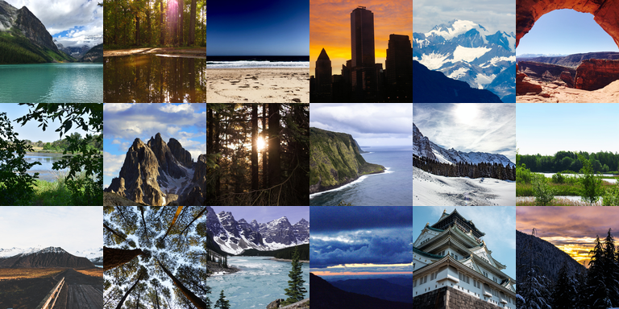
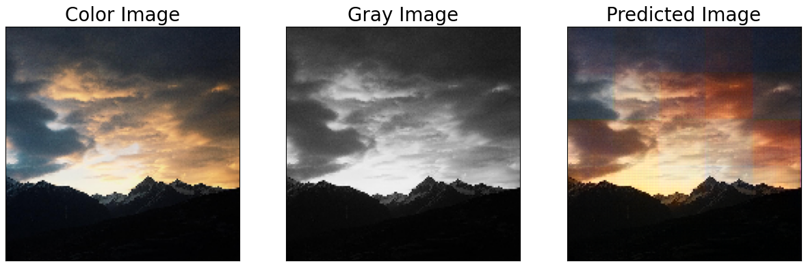

# 🎨 Projekt WDSNIUM: Autoenkoder do kolorowania obrazów czarno-białych

## 📖 Opis
Ten projekt dotyczy stworzenia autoenkodera do kolorowania obrazów czarno-białych. Autoenkoder jest modelem uczenia maszynowego, który uczy się reprezentacji danych w niesupervisowanym sposobie. Naszym celem jest automatyczne przywracanie kolorów do obrazów, które pierwotnie były czarno-białe, wykorzystując zaawansowane techniki uczenia maszynowego i sztucznej inteligencji.

## 📚 Dataset
Używamy zbioru danych "LHQ 1024", który zawiera 90,000 wysokiej rozdzielczości obrazów krajobrazów naturalnych, pozyskanych z Unsplash i Flickr. Zbiór został przetworzony za pomocą Mask R-CNN i Inception V3, co zapewnia wysoką jakość i użyteczność obrazów.

Więcej informacji o zbiorze danych można znaleźć na stronie [Kaggle LHQ 1024](https://www.kaggle.com/datasets/dimensi0n/lhq-1024/data).

## Wyniki
Przykładowe wyniki modelu

